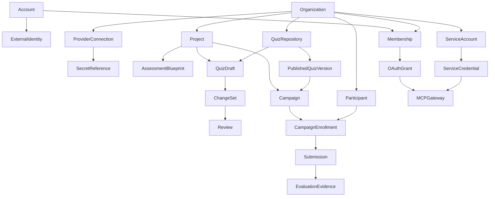

# MD Quiz 平台化演进蓝图

> 状态：产品与架构提案，不代表当前代码已经实现。
> 最后核对：2026-07-22。

## 一句话方向

把 `md-quiz` 从“单实例、单管理员的测评执行工具”演进为一个 **Git-native、AI-native、多租户的结构化测评平台（AssessmentOps）**：组织可以共同设计、审核、发布、执行和持续改进测评；人和智能体都通过同一套权限、审计与版本边界安全地使用它。

它不应成为通用 LMS，也不应退化成普通表单工具。真正的差异化应该是：

- 测评内容可版本化、可审核、可回滚；
- 每个结果都能追溯到题目、评分规则、Git commit、模型与人工复核；
- AI 能提高设计和判卷效率，但正式发布与高风险决策仍由人负责；
- REST、Webhook 与 MCP 共用同一业务能力和授权模型，而不是三套平行实现。

## 1. 当前事实基线

以下是现有代码能够证明的事实，也是规划必须正面处理的约束。

| 维度 | 当前事实 | 对演进的直接影响 |
| --- | --- | --- |
| 身份 | 后台使用环境变量中的单一管理员账号密码，Session 只记录是否登录与用户名 | 还没有平台用户、外部身份、组织成员或权限模型 |
| 数据命名空间 | `candidate.phone`、`quiz_key`、运行配置、仓库绑定、任务去重与日志均处于全局域 | 不能只增加用户表；必须先逐表区分平台域、组织域和公开入口，再完成租户化 |
| Git | 一套实例只支持通过 HTTPS 拉取一个仓库并读取内容，当前没有正式的私有凭据模型或写回能力 | 已有 Git 导入和不可变版本基础，但没有组织级绑定、私有凭据、分支、提交或写回；还需禁止并清洗 URL 内嵌凭据 |
| QML | 正式仓库结构是 `md-quiz-repo.yaml + quizzes/<quiz_id>/quiz.md`；内容由当前 parser 校验 | UI 与 AI 都必须生成符合现行 QML/parser 契约的内容，不能发明页面专用语法 |
| AI 生成 | 代码中已有从提示词生成 QML 草案的服务能力 | 还没有形成正式管理界面、审核、Git 写回和发布闭环 |
| 配置 | LLM、短信和 MCP 密钥主要来自进程环境变量；运行配置保存在全局 `runtime_kv` | 不能支持组织级 BYOK，也无法保证 Worker 使用正确组织的配置 |
| MCP | 已有 `/mcp` Streamable HTTP 服务，使用一枚全局 Bearer Token，覆盖运维、测验、候选人与邀约工具 | MCP 不是从零建设，而是要从“全局管理员遥控器”升级为组织级、用户级、范围化平台接口 |
| 运行面 | FastAPI API、Worker、Scheduler 与 PostgreSQL 任务队列已经稳定分层 | 可以沿用现有执行面，但组织业务任务的载荷、去重、用量和审计都要携带组织与发起人上下文；平台任务另行隔离 |

主要依据：

- [当前愿景与范围](vision.md)
- [数据库事实](../backend/md_quiz/storage/db.py)
- [后台登录实现](../backend/md_quiz/api/admin_core_routes.py)
- [QML parser](../backend/md_quiz/parsers/qml.py)
- [Quiz 仓库规范](../skills/quiz-repo-spec/references/repo-contract.md)
- [当前 Git 同步实现](../backend/md_quiz/services/exam_repo_sync_repo.py)
- [当前 MCP 能力](reference/mcp.md)
- [当前 MCP 实现](../backend/md_quiz/mcp/server.py)
- [当前配置边界](reference/configuration.md)

## 2. 产品原则

### 2.1 组织是安全边界

先为现有表、`runtime_kv` key、任务、指标和日志建立所有权矩阵，明确三种范围：

- `platform`：数据库迁移、进程心跳、平台健康指标和内部运维审计，不伪造 `organization_id`，放在独立表或使用显式 `scope_type`；
- `organization`：测验、参与者、答卷、业务任务、组织审计、用量、仓库和集成配置，必须有明确的 `organization_id`；
- `public capability`：答题等匿名入口只持有高熵随机 capability token，数据库仅保存哈希，并通过最小全局注册表或受限函数先解析到组织和资源。

组织不能从请求体中的任意 ID 推断。后台请求从已验证身份和有效授权解析；公开请求从 capability token 解析，之后仍须在该组织范围内查询。

### 2.2 后台用户与被测参与者分离

`account` 是设计、运营和审核测评的平台用户；`candidate/participant` 是组织拥有的受测者资料。候选人不应为了答一份问卷而成为组织成员。未来如需要员工长期门户，可以建立可选的参与者身份关联，但仍不能与后台权限合并。

### 2.3 Git 管内容，数据库管运行

- Git 是已保存草稿检查点和已发布测评内容的事实来源，包括 QML、图片、manifest、README 与发布 commit。
- PostgreSQL 保存账号、组织、权限、协作状态、运行投影、邀约、答卷、判卷、任务、审计和用量。
- 对象存储承载简历、名片、作品附件及较大资源。
- 密钥管理系统承载 LLM、短信、Git 与 OAuth 密钥；Git 和普通业务表都不保存明文密钥。

答卷、候选人资料、模型私钥和短信私钥永远不得提交到 Git。由于 QML 中可能包含正确答案，正式测评仓库默认必须是私有仓库。

### 2.4 AI 生成提案，人批准结果

AI 可以生成、修改、解释、检查和比较草稿，也可以给出评分建议；但不能绕过校验直接写默认分支，不能自动发布正式测评，也不能独立做出招聘、晋升或认证的最终决定。

### 2.5 协议入口共享同一授权核心

页面、REST、MCP、Webhook 和 Worker 必须调用同一服务层策略，统一解析：

```text
HumanPrincipal   = account + organization + membership + permissions + correlation_id
ServicePrincipal = service_account + organization + grant/scopes + correlation_id
```

人员账号通过 `Membership` 取得组织权限；服务账号不伪装成人员成员，通过独立授权取得固定 scope。禁止在每种协议里各写一套组织过滤和权限判断。

## 3. 目标领域模型



建议统一这些产品概念：

- `Account`：平台级用户，可绑定多个登录身份并加入多个组织。
- `ExternalIdentity`：微信、支付宝、企业 SSO 等外部身份，不直接携带业务权限。
- `Organization`：租户、安全、计费、数据保留和配置边界。
- `Membership`：账号在组织中的成员关系、状态和角色。
- `Project`：组织内长期存在的内容与协作空间，例如某个岗位族、能力体系或认证产品线。
- `AssessmentBlueprint`：能力维度、行为指标、证据要求、题量、权重与合格规则。
- `QuizDraft / ChangeSet / Review`：创作、变更与审核过程。
- `PublishedQuizVersion`：绑定 Git commit 与内容摘要的不可变发布版本。
- `Campaign`：一次有时间窗口和目标人群的实际执行批次，固定使用一个发布版本。
- `Participant`：组织内受测者；当前 `candidate` 可逐步映射到此概念。
- `CampaignEnrollment`：参与者加入某个 Campaign 的关系，承载邀约、作答状态和批次内属性。
- `EvaluationEvidence`：自动评分、模型输出、人工复核、修改理由与最终结论的证据链。

第一阶段只支持一层组织加项目，不建设任意嵌套组织树。复杂集团可以通过多个组织和平台级管理关系解决，避免过早引入难以审计的继承权限。

## 4. 多用户、组织与权限

### 4.1 注册与账号绑定

推荐把微信和支付宝作为 `ExternalIdentity` provider 接入，而不是把它们直接当用户表：

1. 用户通过微信或支付宝完成登录授权；
2. 平台根据 `provider + provider_app + subject` 找到稳定身份；
3. 新用户创建 `Account`，已有用户进入账号绑定流程；
4. 用户创建组织或接受组织邀请；
5. 组织权限只来自有效的 `Membership`，不来自社交账号资料。

必须同时设计：账号绑定、解绑、身份失效、会话撤销、换手机、找回账号和最后一个登录方式保护。禁止根据昵称或未经验证的手机号自动合并微信与支付宝账号。

面向企业客户，后续增加 OIDC/SAML SSO、SCIM、通行密钥和 MFA；微信/支付宝不能成为唯一的企业身份治理方案。

### 4.2 组织加入策略

组织可选择邀请制或申请审核制。自助创建组织要具备验证码、频率限制、免费额度和滥用检测，避免短信、模型与 Git 资源被批量盗用。

一个账号可加入多个组织，并显式切换当前组织。切换只改变操作上下文，不能把上一组织缓存的数据带入下一组织。

### 4.3 权限模型

初期采用“固定角色 + 细粒度权限码”，不要一开始建设通用策略语言。

| 默认角色 | 主要能力 |
| --- | --- |
| Owner | 组织所有权、成员、账单、密钥、数据导出与组织删除；至少保留一名 Owner |
| Admin | 成员、项目、集成、配额与组织配置，不可转移或删除组织所有权 |
| Author | 创建和修改蓝图、题目与草稿，不能自行批准受保护发布 |
| Reviewer | 评论、要求修改、批准变更和在策略允许时发布 |
| Operator | 创建 Campaign、管理参与者、邀约、补测和人工处理状态 |
| Analyst | 查看聚合结果、质量分析与授权范围内的明细 |
| Auditor | 只读查看版本、配置变更、审计与证据链 |

高价值权限应独立建码，例如：

- `quiz.read / quiz.draft.write / quiz.review / quiz.publish`
- `participant.read / participant.sensitive.read / participant.delete`
- `campaign.operate / result.review / result.export`
- `integration.manage / secret.rotate / audit.read`
- `mcp.client.manage / organization.member.manage`

读取候选人敏感资料、发布、删除、导出和密钥轮换需要额外审计，必要时要求二次验证或双人批准。

`permission` 是平台维护的全局不可变权限码目录。自定义角色属于某个组织，`membership_role` 必须通过复合外键保证成员、角色与组织一致。服务账号不是默认角色，也不拥有 `Membership`；它使用独立 grant，只能取得显式 scope、有效期和项目范围。

## 5. AI 交互式问卷工作台

### 5.1 从“写题”升级为“设计测评”

AI 工作台的第一步不是立刻生成题目，而是形成可审核的 `AssessmentBlueprint`：

- 使用场景与目标人群；
- 要测的能力维度与行为指标；
- 每个维度需要的证据、题型、题量和权重；
- 难度、时长、语言、合格规则和风险等级；
- 是否允许量表、作答计分、简答与 LLM 判卷；
- 是否需要人工复核或多评委评分。

随后再生成“维度—题目—rubric—得分”的覆盖矩阵。这样 AI 的任务是完成一个可验证设计，而不是一次性吐出一段看似完整的 Markdown。

### 5.2 推荐界面

工作台同时提供三种视图，但共享一个草稿状态：

- 对话：用自然语言新增、删减、改写、调难度、改分值或补 rubric；
- 结构化编辑：逐题编辑类型、选项、答案、评分、限时、维度和资源；
- 实时预览与语义 diff：展示候选人视图，以及题数、总分、答案、rubric、限时、维度和资源的变化。

非技术用户不需要理解 Git；专业用户仍可查看原始 QML 和 commit。

### 5.3 AI 只提交受约束的语义变更

长期推荐引入内部 Quiz IR/AST。AI 只提交领域操作，例如“新增题目”“改写 Q3 rubric”“把 Q5 难度调高”，服务端再把 IR 编译为 QML。但采用 IR 的前置条件是经过基于真实仓库样本的无损 round-trip 测试：注释、格式、未知字段和未来扩展都能保留，序列化结果稳定。当前 parser 不能自动证明这些性质。

因此第一版应使用受约束的 QML 变更集、基于 `base_commit` 的补丁和真实 parser 校验；只有无损 serializer 成熟后，IR 才能成为唯一写入路径。任何阶段都不得把未经校验的模型全文输出直接覆盖仓库文件。

每次变更必须经过同一条管线：

```text
用户意图
  -> 受约束 QML 变更 / 无损 IR 操作
  -> 权限与并发版本检查
  -> 补丁应用 / QML 序列化
  -> 当前 parser 真实校验
  -> 仓库资源与路径校验
  -> 语义质量检查
  -> 预览 / diff
  -> 保存草稿检查点
```

这样可以避免模型漏写题头、正确答案、rubric、限时或资源路径，并且可以给用户准确定位错误。解析规则仍以 [QML 规范](../skills/qml-authoring/references/qml-spec.md)、[parser 契约](../skills/qml-authoring/references/parser-truth.md)、实际 parser 与测试为准。

### 5.4 发布门禁

发布前至少检查：

- QML 与 manifest 合法，`id`、目录名和元数据一致；
- 图片存在、未越界、大小和类型符合仓库契约；
- 题数、总分、预计时长和蓝图覆盖率满足要求；
- 单选、多选、量表、作答计分和简答评分规则一致；
- 正确答案没有出现在题干、提示或候选人公开 spec 中；
- rubric 可操作、重复题和歧义题已提示；
- 无障碍和移动端预览通过；测评声明了多语言版本时，额外要求语言完整性与等价性检查；
- 高风险场景已达到所需审核人数。

AI 质量检查只产生警告和证据，不替代 parser 的确定性校验。

## 6. Git-native 内容生命周期

### 6.1 推荐仓库模式

默认提供平台托管的私有 Git，让普通组织开箱即用；它只是平台内部的测评内容版本存储，不提供通用 Git 项目、SSH 托管、Issue 等能力。成熟团队也可以绑定自己的 GitHub、GitLab、Gitee 或企业 Git。外部仓库使用 Git App、安装令牌或受限 deploy key，不把凭据拼入 URL；输入与日志都必须拒绝或清洗 URL 内嵌凭据。

仓库从当前“实例级单一绑定”升级为组织拥有的 `QuizRepository`。第一版可以限制每组织一个默认仓库，但数据模型和任务键必须从一开始按 `organization_id + repository_id` 设计。

### 6.2 草稿、检查点与发布

推荐流程：

1. 实时协作状态自动保存在数据库，提供快速编辑和断线恢复；
2. 用户点击保存或系统形成有意义的检查点时，写入 `draft/<quiz>/<change-set>` 分支；
3. 服务更新 `quiz.md` 与相关资源；只有新增、删除或重命名测验时才更新 `md-quiz-repo.yaml`，README 只维护明确标记的生成区块，保留人工内容；
4. CI 执行 parser、仓库、质量和安全检查；
5. Reviewer 在 UI 或外部 PR 中审核语义 diff；
6. 批准后合并默认分支，发布记录绑定 merge commit 与内容 hash；
7. 同步器把该 commit 投影成不可变 `quiz_version`，Campaign 只引用发布版本。

每个变更集保存 `base_commit`。如果 UI 修改期间外部 Git 已变化，必须显式 rebase/合并并展示冲突，不允许静默覆盖。

### 6.3 双向同步规则

- Git webhook 触发增量同步，轮询作为补偿机制；
- 幂等键至少包含组织、仓库与 commit；
- 重绑只影响该组织和该仓库，不删除其他组织数据；
- 更换仓库默认停用旧内容并保留历史答卷，不把“重绑”实现为删除全部归档；
- 发布失败不会改变当前线上版本；
- 回滚是重新发布旧 commit，而不是修改历史版本。

### 6.4 QML vNext 的边界

先把现有 QML v2 的创作和发布闭环做好，再通过单独 RFC 评估 `section`、题池、随机抽题、本地化版本、条件分支和可复用 item 引用。条件分支只适合访谈/调研等场景；需要横向可比的考试不能默认使用动态路径。

任何扩展都必须升级 schema、parser、仓库规范和迁移工具，不能用页面私有字段绕过正式契约。

## 7. 组织级模型、短信与集成配置中心

### 7.1 配置模型

将每项集成拆成非敏感元数据与 `secret_ref`：

- `ProviderConnection`：组织、类型、名称、状态、base URL、模型、能力、超时、用途、配额和最近测试结果；
- `SecretReference`：加密密文或外部 Vault 引用、密钥版本、创建人、轮换时间和状态；
- `FeatureRouting`：创作、判卷、简历解析、视觉理解分别使用哪个连接，是否允许 fallback；
- `UsageLedger`：调用次数、token、短信、费用、失败和预算预警。

密钥只能创建、替换、测试、吊销，接口和 MCP 永远不返回明文；可恢复凭据只在创建瞬间显示一次，存储侧只保留哈希或加密密文。

### 7.2 大模型连接

组织可配置多个模型连接，并按功能路由。当前客户端基于 OpenAI-compatible Responses API，因此配置页面必须做真实能力探测；只支持 `chat/completions` 的地址应明确拒绝或走独立适配器，不能把“可填写 base URL”误当成兼容。

自定义地址还必须防御 SSRF：要求 HTTPS、限制重定向、校验 DNS/IP、阻止 link-local 和云元数据地址，并通过受控出口访问。需要连接企业内网模型时，应提供专门的私网连接器或出站代理，而不是放开任意 URL。

组织还应配置：

- 允许发送的数据分类，例如题目可发送、简历默认不可发送；
- 每日/月预算、单次 token 上限与并发限制；
- 模型不可用时是失败、降级还是转人工；
- prompt 与模型版本、温度等执行参数的发布记录；
- 黄金样本回归与新旧模型影子判卷。

### 7.3 短信配置

短信按 provider、用途和环境管理：登录验证、答题验证、邀约提醒与结果通知使用不同模板。每个模板需要审核状态、变量 schema、测试发送、签名、频率限制、静默时段、失败重试和费用上限。

短信调用必须显式接收组织配置，不能让 Worker 继续读取全局环境变量。手机号、模板参数和供应商错误日志都要脱敏。

### 7.4 其他组织配置

- Git 仓库与回调；
- 品牌、域名、时区、语言和邮件发送；
- 数据保留、导出、删除与归档策略；
- Webhook 终端、签名密钥、事件范围和重放策略；
- 登录策略、邀请策略、MFA 和允许的 MCP 客户端。

每次配置变更都形成版本与审计事件；高风险配置支持“四眼原则”。

## 8. 测评项目与持续质量

仅有 `quiz + assignment` 不足以承载组织协作。建议增加 `Campaign`：

- 固定场景、目标人群、发布版本、负责人、审核人和时间窗口；
- 支持批量参与者、分组、补测、复测、周期重认证；
- 支持结构化访谈、多评委独立评分和校准；
- 所有结果基于同一发布版本，避免内容变化污染比较。

在此基础上建设题库与质量工程：

- 题目、题组、rubric、维度与报告模板复用；
- 草稿、试测、正式、暂停、泄露、退役生命周期；
- 难度、区分度、作答耗时、弃答率、选项分布和版本可比性；
- 样本量不足时不输出误导性统计结论；
- 公平性、群体差异、无障碍和语言等价性检查；
- 人工评分与 AI 评分一致性、申诉率和复核修改率。

每个最终结果形成可复现证据链：

```text
结果
  -> Campaign 与参与者事件
  -> 发布版本与 Git commit
  -> 题目、答案、rubric 与能力维度
  -> 判卷模型、prompt、参数与组织策略
  -> 自动评分证据
  -> 人工复核、修改原因与最终决定
```

## 9. MCP 与开放平台

### 9.1 现状判断

当前 MCP 已具备可用的 Streamable HTTP 服务和丰富工具，适合单实例受控管理，但以下机制不能直接带入多租户 SaaS：

- 一枚全局 Bearer Token 代表所有管理员权限；
- token 可从后台取回明文；
- 工具通过全局服务访问数据，没有组织或成员上下文；
- `include_sensitive=true` 与 `confirm=true` 是调用参数，不能充当权限或真实人工批准；
- 审计主体只有笼统的 `mcp`，无法归因到用户、客户端和授权范围；
- 工具还没有声明只读、破坏性、幂等和外部影响等 annotations；
- SDK 的 DNS rebinding 防护被显式关闭，当前部署需要在入口网关补齐可信 Host、Origin 与请求边界校验。

多组织上线前，现有 MCP 必须限制在默认组织的迁移兼容模式，或暂时关闭，不能让全局 token 穿透新租户边界。

### 9.2 目标鉴权

推荐以 OAuth 2.1 授权码 + PKCE 作为人类用户接入的主路径，并实现 MCP protected-resource metadata、授权服务器发现、`resource/audience` 校验、短期 access token、refresh、撤销与 scope。

同时提供：

- 预注册 OAuth client，兼容需要 Client ID/Secret 与固定回调的平台；
- 服务账号和短期、范围化凭据，供 CI 或后端自动化使用；
- Personal Access Token 仅供明确支持自定义 Header 的受控客户端，创建时显示一次、数据库只保存哈希；
- 每个 grant 只绑定一个当前组织，跨组织操作必须单独授权；
- token 中携带不可伪造的组织、主体、client、scope 与授权版本；每次请求还要通过在线 introspection、短缓存的成员/授权版本或撤销表校验。短期 JWT 本身不能保证成员停用后立即失效。

组织 ID 由 token 和授权记录解析；MCP 工具不能依赖模型传入 `organization_id` 来决定访问范围。最终允许范围取 `OAuth scope ∩ 组织成员权限 ∩ 工具策略` 的交集。

### 9.3 工具面设计

工具按只读、可逆写入、重要写入和敏感读取分类，并准确声明 `readOnlyHint`、`destructiveHint`、`idempotentHint`、`openWorldHint`，同时为每个工具声明匹配的 `securitySchemes` 与 scope。建议把工具集控制在清晰的业务动作，而不是暴露底层数据库 CRUD。

普通连接器按已批准配置暴露一组稳定工具，避免客户端缓存或快照 `tools/list` 后出现语义漂移；高权限运维工具使用独立内部入口。工具发现可以改善体验，但不是安全边界：每次 `tools/call` 都必须重新验证 token、组织、scope、成员/授权版本、参数对象和工具策略。

| 工具域 | 示例目标工具 | 最小 scope | 额外保护 |
| --- | --- | --- | --- |
| 发现 | `quiz_search`、`quiz_get`、`campaign_get` | `quiz.read` | 默认脱敏 |
| 创作 | `quiz_draft_create`、`quiz_draft_patch`、`quiz_validate`、`quiz_diff` | `quiz.draft.write` | 乐观锁、parser 校验 |
| 审核发布 | `quiz_submit_review`、`quiz_publish_prepare`、`quiz_publish_execute` | `quiz.review` / `quiz.publish` | 独立人工批准、一次性批准记录 |
| 运营 | `campaign_create`、`participant_invite`、`job_get` | `campaign.operate` | 幂等键、配额、异步任务 |
| 结果 | `result_summary`、`result_evidence_get` | `result.read` | 敏感明细需独立 scope 与理由 |
| 组织配置 | `provider_connection_test`、`usage_summary` | `integration.manage` / `usage.read` | 永不提供 `secret_get` |

删除、正式发布、批量邀约、敏感导出等操作使用两阶段协议：`prepare` 固化规范化参数及其 hash，只返回不可执行的 `approval_request_id`；被授权用户必须在独立平台 UI 中二次验证并写入批准记录，不能把可执行 action token 交给模型。`execute` 重新校验参数 hash、组织、发起人、批准人、权限、有效期和单次使用状态；高风险策略可要求发起人与批准人不同。模型自行把 `confirm` 设为 `true` 不视为人工授权。

所有写工具必须接收客户端可稳定重放的幂等键；两阶段动作也可从已批准的 `approval_request_id` 确定性派生。服务端持久化“幂等键 + 规范化参数 hash + 首次结果”，同键异参直接拒绝，不能用每次请求新生成的随机键假装幂等。实例进程、全局阈值、平台级日志等运维工具移入内部 MCP/运维 API，不暴露给普通组织连接器。

耗时操作立即返回 `job_id`，通过 `job_get`、订阅或 webhook 获取进度；不要让 MCP 请求长时间阻塞。列表工具必须分页，响应有大小上限。限流同时覆盖 IP、client、credential、用户、组织、工具和并发，并叠加模型/短信等业务预算；触发时返回结构化错误、`429` 和合理的 `Retry-After`。

成功、鉴权失败和策略拒绝都进入审计，至少记录 `allow/deny、principal、organization、client_id、grant/token hash、tool、scope、批准 ID、参数摘要、schema version、结果/错误码、耗时、IP/UA、限流结果、correlation_id`，同时对 PII、prompt 和凭据脱敏。

### 9.4 REST 与 Webhook 契约

REST、Webhook 和 MCP 共享领域服务，但各自需要可长期维护的协议契约：

- REST 使用显式版本、游标分页、结构化错误码、请求/响应 schema 和写操作幂等键；
- 破坏性变更必须经过公告、弃用期和版本迁移，不能静默改变字段含义；
- Webhook 事件有独立 `event_type + event_version + event_id`，载荷只含订阅方必要的数据；
- Webhook 使用可轮换签名密钥、时间戳和重放窗口，投递记录可查询、可重试并进入死信队列；
- REST、Webhook 与 MCP 的同一业务动作共享权限、审计、错误语义和 correlation ID。

### 9.5 平台兼容目标

截至 2026-07-22，三类目标平台都可以围绕一个标准 Streamable HTTP `/mcp` 入口设计，无需为每家复制业务实现：

| 平台 | 当前官方边界 | 本项目目标 |
| --- | --- | --- |
| ChatGPT Apps SDK | 推荐 Streamable HTTP；用户特定数据和写操作应使用符合 MCP 规范的 OAuth 2.1；工具可声明安全方案和确认语义 | 完整 OAuth discovery、PKCE、CIMD/DCR 或预注册 client、精确 tool annotations；后续可增加内嵌预览/diff/审批 UI |
| Claude API MCP connector | API 调用可随请求提供远程 MCP URL 与授权 token，当前托管 connector 重点支持工具调用 | 保持标准结构化工具返回，不依赖某一家 UI 扩展；服务端仍逐次执行完整授权 |
| Claude Web / Desktop 自定义连接器 | 请求来自 Anthropic 云端，远程服务需公网可达或正确 allowlist；按用户建立连接，可配置 OAuth client | 提供公网 HTTPS、每用户授权与预注册 client，不能假设能访问用户本机或企业内网地址 |
| 腾讯云智能体开发平台 | 自定义连接器支持初始化、`tools/list`、`tools/call`、SSE/Streamable HTTP、自定义 Header 与 OAuth 2.0 配置 | 优先使用经互操作测试的 OAuth；若客户端不满足本项目 OAuth 2.1/PKCE 要求，仅为工作流/服务身份提供组织范围 PAT/Header，不降级人员登录安全 |

选择 Streamable HTTP 作为唯一默认传输；只有明确客户需求时才维护旧 SSE，避免双传输长期增加测试面。

建议内置“连接器体检”：自动验证 HTTPS、初始化、工具发现、401 challenge、OAuth metadata、scope、超时、幂等和脱敏结果，并按 ChatGPT、Claude、腾讯平台维护可重复的兼容测试档案。

### 9.6 MCP Apps 的大胆设想

在 headless MCP 稳定后，可为支持 MCP Apps 的客户端返回交互组件，让用户在对话中直接：

- 预览问卷；
- 查看语义 diff 与蓝图覆盖矩阵；
- 评论或批准变更；
- 选择 Campaign 和参与者；
- 查看脱敏结果摘要与证据链。

这应是标准工具之上的增强层，而不是核心业务对特定客户端的依赖。

## 10. 目标技术架构

现有 API / Worker / Scheduler 可以保留，但增加明确的控制面：

```text
Browser / REST / MCP / Webhook
              |
        Identity & OAuth
              |
     Tenant + Policy Gateway
              |
  Domain Services + Audit Context
      |        |        |
 Authoring   Campaign   Integration
      |        |        |
 PostgreSQL  Git       Secret Manager
      |
 Transactional Outbox
      |
 Worker / Scheduler / Webhook Delivery
```

关键约束：

- 公网入口网关负责 TLS、可信 Host/Origin、请求大小、超时、并发、速率限制和 trace；
- 每个存储接口显式接收组织上下文，不能只依赖进程全局变量或隐式 `ContextVar`；
- API 使用非表 owner、无 `BYPASSRLS` 的业务数据库角色，组织表启用 `FORCE ROW LEVEL SECURITY`；每个事务通过 `SET LOCAL app.organization_id` 设置上下文，未设置时默认拒绝，禁止使用可能泄漏到连接池下一请求的普通 `SET`；
- Worker 先通过权限受限的跨租户 claim 函数取得 `job_id + organization_id`，再开启带 `SET LOCAL` 的租户事务处理业务数据；任务结束必须清除上下文。Scheduler 的平台扫描只负责拆出组织任务，不直接在一个无边界事务里处理所有租户；
- 组织 Worker job 顶层保存 `organization_id、requested_by、repository/config revision、correlation_id`；平台迁移和健康任务进入独立队列/表；
- 任务去重键按组织和资源范围唯一；
- 答题 capability token 使用密码学安全的高熵随机值，数据库只存 hash；最小全局注册表或受限 `SECURITY DEFINER` 函数只解析 `token_hash -> organization/resource/status/expiry`，随后进入组织事务；
- 公开题目资源不得仅凭可猜测的 `quiz_key`、版本数字或路径访问；必须绑定当前答题 capability，或使用短期签名 URL / 不可猜内容资源 ID，并同步更新 public spec；
- 组织级查询在应用层强制过滤，并使用 PostgreSQL RLS 作为第二道防线；连接池测试必须证明 A 组织的事务上下文不会泄漏给 B 组织或无组织请求；
- 领域事件通过 transactional outbox 可靠投递 Webhook、指标和通知；
- 平台运维日志与组织审计日志分离，组织管理员看不到全平台健康数据和其他租户元数据；
- 高风险动作无法可靠写入审计时失败关闭，不能吞掉审计异常后继续执行。
- schema 变更只由独立迁移任务执行；API、Worker、Scheduler 启动时只检查 schema 版本，不能继续调用 `init_db()` 动态补列或重建旧约束。滚动发布采用 expand/contract，并明确旧进程何时退出约束切换。

## 11. 数据模型与迁移重点

建议新增：

- `account、external_identity、login_session`
- `organization、organization_membership、organization_invitation`
- `permission、organization_role、membership_role`
- `service_account、api_credential、oauth_client、oauth_grant`
- `project、assessment_blueprint、campaign、campaign_enrollment`
- `quiz_repository、quiz_draft、quiz_change_set、quiz_review`
- `provider_connection、secret_reference、feature_routing`
- `public_capability、audit_event、usage_ledger、event_outbox、webhook_delivery`

迁移前先输出逐表、逐 `runtime_kv` key 的所有权矩阵，分别标记 `platform / organization / public capability`；JSON 内已有某个 ID 不能作为租户归属证据。组织业务表、任务、指标和日志增加顶层 `organization_id`，平台运行数据保留独立范围。尤其要处理：

- 当前 `candidate.phone` 的全局唯一约束改为组织内唯一；
- `quiz_definition` 增加内部稳定 `quiz_id`，当前全局 `quiz_key` 主键改为组织内唯一；
- 当前版本唯一键、活动任务去重键等全局约束全部改为组织范围；
- 版本、资源、答卷和归档通过内部 ID 与包含 `organization_id` 的复合外键防止串组织关联；
- `runtime_kv` 拆分平台配置与组织配置，不再用单一全局 key 模拟多租户；
- repository 绑定和同步状态改为正常关系表；
- 组织 job、metric、log、usage 的索引和唯一约束都包含组织，平台 job/metric/log 使用独立表或显式范围；
- 公开 token 从当前截断、无密钥的 SHA-256 派生方式迁移为高熵随机 capability，数据库只存 hash；最小全局索引只保存解析组织和目标所需的字段。

迁移顺序必须是：

1. 引入版本化数据库迁移、完整备份和 schema 版本启动检查，停止 API/Worker/Scheduler 启动时修改 schema；
2. 完成所有权矩阵，创建默认组织，以一次性 CLI/claim token 让现有管理员创建首位 Owner；不根据旧用户名自动合并账号，在认领完成前不开放第二组织；
3. 轮换 Session cookie 名称与签名密钥，限制或吊销全局 MCP token；以可空列加入 `organization_id` 并回填历史数据；
4. 为组织级唯一索引和复合外键建立 shadow 约束，改造所有存储接口、公开资源路由、任务和服务层；
5. 对读写路径、Worker claim 和 RLS 做双写/影子验证，再验证新约束；应用数据库角色必须是非 owner、无 `BYPASSRLS`，迁移角色与业务角色分离；
6. 切换到新索引/外键后，才删除 `candidate.phone`、`quiz_key`、版本与活动任务去重等旧全局约束；验证无孤儿数据后将组织列设为非空；
7. 轮换或限期兼容旧答题 token，移除环境变量单管理员和全局 MCP 入口，确认旧进程退出后才开放第二个组织。

不要在大表上一次性替换所有约束，也不要在新旧进程混跑时切除旧约束。任何能全局列举或删除业务数据的旧路径都必须在开放第二组织前变为不可达。

## 12. 安全与治理硬门槛

- 租户隔离：任何按数字 ID、`quiz_key`、资源路径和任务 ID 的访问都做组织校验；
- 密钥：信封加密或外部 KMS/Vault、轮换、吊销、版本、最小读取面和访问审计；
- OAuth：state、PKCE、issuer、audience、expiry、scope、撤销与回放防护完整校验；
- PII：默认脱敏、数据最小化、字段级导出权限、保留期限和删除流程；
- LLM：prompt injection、数据外传、模型回退和供应商保留策略纳入组织政策；
- Git：私有仓库、短期凭据、受保护分支、签名 webhook、禁止凭据进入 URL/日志；
- Webhook：签名、重放窗口、幂等、失败队列和可人工重放；
- MCP：最小 scope、速率限制、工具级批准、敏感读取理由与完整审计；
- 供应链：依赖与镜像扫描、插件和测评包签名；
- 恢复：组织级导出、备份恢复演练和 Git/数据库一致性校验。

最重要的隔离验收场景包括：

- 两个组织可以使用相同手机号和相同 `quiz_key`，且互不可见；
- 猜测另一个组织的版本 ID、资源 URL、job ID 或 token 不会返回元数据；
- 即使知道 `quiz_key`、版本 ID 和资源路径，没有匹配的答题 capability 或短期签名也不能读取题目资源；
- 连接池复用后，A 组织的 `SET LOCAL` 上下文不会进入 B 组织或无组织事务；
- 两个组织并发判卷时分别使用自己的模型与预算；
- 同名任务不会跨组织去重；
- A 组织重绑仓库不影响 B 组织内容或历史答卷；
- 成员停用后旧 Session、PAT、OAuth token 与 MCP 授权及时失效；
- MCP 即使传入 `include_sensitive=true` 或伪造组织 ID，也不能越过 scope。

## 13. 分阶段路线图

| 阶段 | 交付重点 | 上线门槛 |
| --- | --- | --- |
| P0：租户安全底座 | 默认组织、版本化迁移、Account/Identity/Organization/Membership、请求与任务主体、组织列/RLS、审计、密钥库 | 双组织隔离测试全部通过；旧管理员完成 Owner 迁移；全局 MCP 不可访问多租户数据 |
| P1：组织协作与配置 | 微信/支付宝登录、邀请与角色、组织切换、模型/短信/Git 配置、最小 Project/Campaign/Enrollment 骨架、范围化服务账号与只读 MCP | 密钥不可回读；Worker 使用正确组织配置；成员撤销及时生效；MCP 每次调用按组织授权 |
| P2：创作与 Git 发布 | 蓝图、受约束 QML 变更（无损条件满足后再切 Quiz IR）、对话与结构化编辑、实时预览、分支检查点、语义 diff、审核、合并、回滚；开放低风险草稿 MCP | 任意发布可追溯 commit；冲突不静默覆盖；未经审核不能发布受保护测评 |
| P3：执行与质量闭环 | Campaign 运营、批量参与者、复测、多评委、题库、质量指标、模型回归、证据链 | Campaign 固定版本；关键评分可复现；统计结果具备样本量门槛 |
| P4：开放平台 | 完整 OAuth 2.1 discovery、版本化 REST/Webhook、两阶段批准、高风险 MCP 写操作、三类平台兼容测试 | 工具级权限和审计完备；删除/发布/敏感导出不能由模型单方面确认 |
| P5：生态与进阶能力 | 签名测评包、专家市场、隐私保护行业常模、自适应测评、可验证认证凭证 | 先具备内容版权、隐私同意、校准样本和反作弊治理，再逐项开放 |

不要并行铺开全部功能。P0 是后续所有阶段的硬依赖；P1 就用租户化只读 MCP 验证授权核心，避免开放能力长期中断；P2 的 Git 发布闭环应先于大规模 AI 自动化；高风险写工具仍等权限和独立审批稳定后开放。

## 14. 还值得大胆设想的方向

### 14.1 测评内容 CI/CD

把 QML 校验、资源检查、难度覆盖、答案泄漏、无障碍、模型回归和审核策略做成类似代码 CI 的发布门禁。每次变更都有语义 diff，而不是只比较 Markdown 行。

### 14.2 组织级模型评测实验室

组织可以用自己的黄金答卷对新模型、prompt 或评分规则做离线回放和影子判卷，比较一致性、成本、延迟和偏差，达标后再提升为生产版本。

### 14.3 评估证据图谱

把岗位/标准、能力维度、题目、作答证据、rubric、评分、人工复核和最终决定连成可查询图谱。它可以支持审计、申诉、解释结果，也能反向发现“某能力没有被真正测到”。

### 14.4 新型证据采集

在传统题目之外，逐步支持作品任务、代码/文档交付、情景模拟、结构化访谈副驾和多评委评分。它们仍然输出结构化证据，不扩展成课程或作业平台。

### 14.5 隐私保护的行业常模

只有组织主动加入、满足最小样本量并经过匿名聚合后，才参与行业基准。不能默认共享原始答卷，也不能在样本不足时包装成权威常模。

### 14.6 签名测评包市场

测评专家可以发布带版本、许可、适用范围、验证报告和数字签名的能力模型、题库、rubric 与报告模板。组织安装后仍复制到自己的私有仓库并独立审核，不让市场包直接进入生产。

### 14.7 自适应测评与可验证凭证

当题目具备足够的校准样本后，再根据难度和信息量动态选题；通过的认证可以签发可验证凭证并支持到期复认证。没有校准数据时不宣传“智能自适应”。

## 15. 商业化与平台运营

建议按管理席位、有效完成次数和 AI/短信实际用量计费，而不是按候选人账号收费。产品层级可以自然分为：

- 社区/私有部署：QML、Git 同步、基础执行与基础 MCP；
- 团队版：多人协作、托管私有 Git、AI 创作、Campaign 和质量分析；
- 企业版：SSO/SCIM、BYOK、私有模型、数据驻留、专属部署、审计、保留策略和 SLA。

平台运营需要配套组织额度、成本归集、异常消费冻结、退款/补偿记录和内部支持审计，但平台客服不能默认读取组织敏感内容。

## 16. 北极星指标

北极星指标建议使用：

> 完成“设计/发布—执行—判卷—复核—改进”并被组织实际采用的有效评估闭环数。

同时关注：

- 从需求到首个可发布版本的时间；
- 发布门禁一次通过率和审核退回率；
- 参与者完成率、异常率与无障碍问题；
- 人工与 AI 评分一致性、复核修改率和申诉率；
- 题目被质量数据驱动改进的比例；
- 每个有效完成的模型与短信成本；
- 跨租户、密钥、越权和数据保留安全事件数，目标必须是零。

## 17. 明确非目标

- 不建设课程、课件、学习路径、学员社群和通用作业系统；
- 不替代完整 ATS、HRIS、CRM、Git 托管或通用审批平台；
- 不把管理界面做成通用 Git IDE 或任意 Markdown 协作工具；
- 不让 AI 自动发布正式测评或独立决定招聘、晋升和认证结论；
- 不把 Git 当运行数据库，不把答卷、个人资料和密钥写入 Git；
- 不在早期建设任意嵌套组织、通用策略语言和无限可配置工作流；
- 不默认采用摄像头、持续录屏等高侵入式监考；
- 不在缺少校准样本时宣称权威常模或自适应测评。

## 18. 建议立即拆出的 RFC

1. `RFC-001`：Account / Identity / Organization / Membership 与历史管理员迁移；
2. `RFC-002`：租户所有权矩阵、数据库迁移、RLS、公开资源和 Worker 上下文；
3. `RFC-003`：组织密钥库、模型/短信连接、用量与 SSRF 防护；
4. `RFC-004`：托管/外部 Git、草稿分支、写回、审核和发布一致性；
5. `RFC-005`：受约束 QML 变更、无损 Quiz IR/serializer、parser 门禁和语义 diff；
6. `RFC-006`：MCP OAuth、scope、工具分类、人工批准、REST/Webhook 契约和客户端兼容测试；
7. `RFC-007`：Assessment Blueprint、Campaign 与评估证据链。

最先应完成 `RFC-001` 与 `RFC-002`。在租户所有权和请求/任务上下文定型前，不建议直接实现组织级配置、Git 写回或新的 MCP 写工具。

## 19. 外部兼容依据

以下链接仅用于确认当前智能体平台的公开接入边界；具体产品界面和要求可能变化，应由兼容测试持续验证：

- [OpenAI Apps SDK：MCP](https://developers.openai.com/apps-sdk/concepts/mcp-server)
- [OpenAI Apps SDK：用户鉴权](https://developers.openai.com/apps-sdk/build/auth)
- [OpenAI Apps SDK：构建 MCP Server 与工具 annotations](https://developers.openai.com/apps-sdk/build/mcp-server)
- [OpenAI Apps SDK：从 ChatGPT 连接](https://developers.openai.com/apps-sdk/deploy/connect-chatgpt)
- [OpenAI Apps SDK：安全与隐私](https://developers.openai.com/apps-sdk/guides/security-privacy)
- [Claude Platform：MCP connector](https://platform.claude.com/docs/en/agents-and-tools/mcp-connector)
- [Claude：远程自定义连接器](https://support.claude.com/en/articles/11175166-get-started-with-custom-connectors-using-remote-mcp)
- [Model Context Protocol：介绍](https://modelcontextprotocol.io/docs/getting-started/intro)
- [腾讯云智能体开发平台：新建连接器](https://cloud.tencent.com/document/product/1759/115873)
